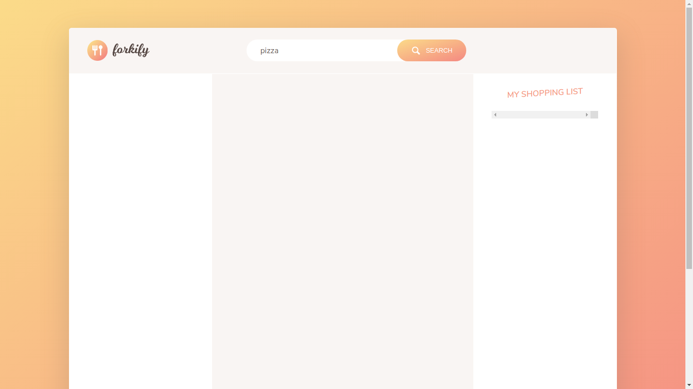
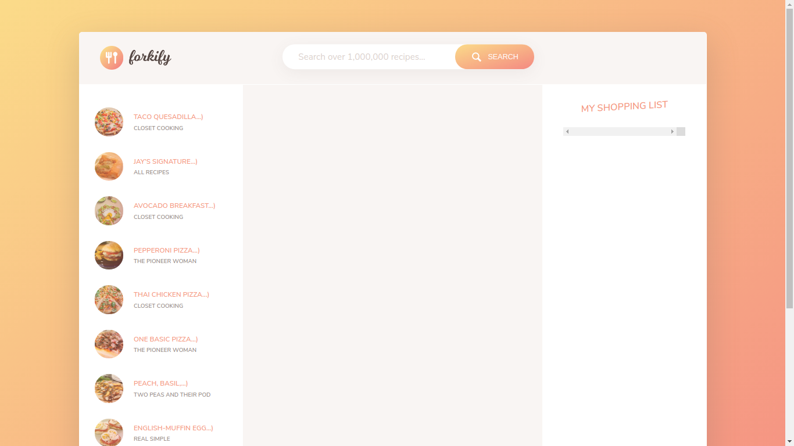
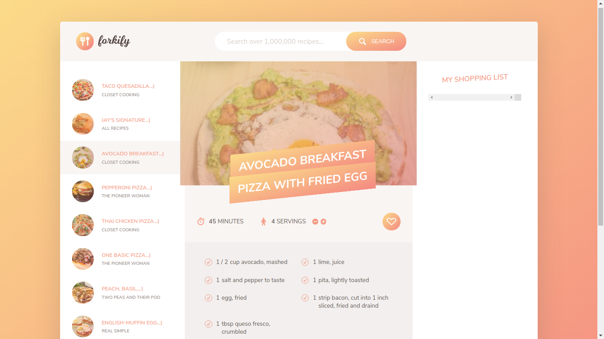
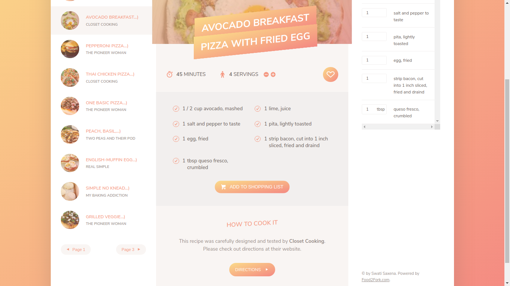
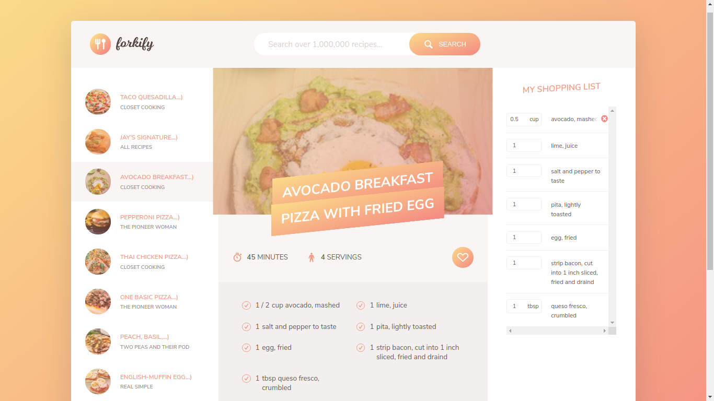
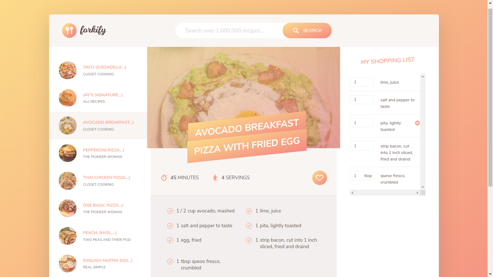
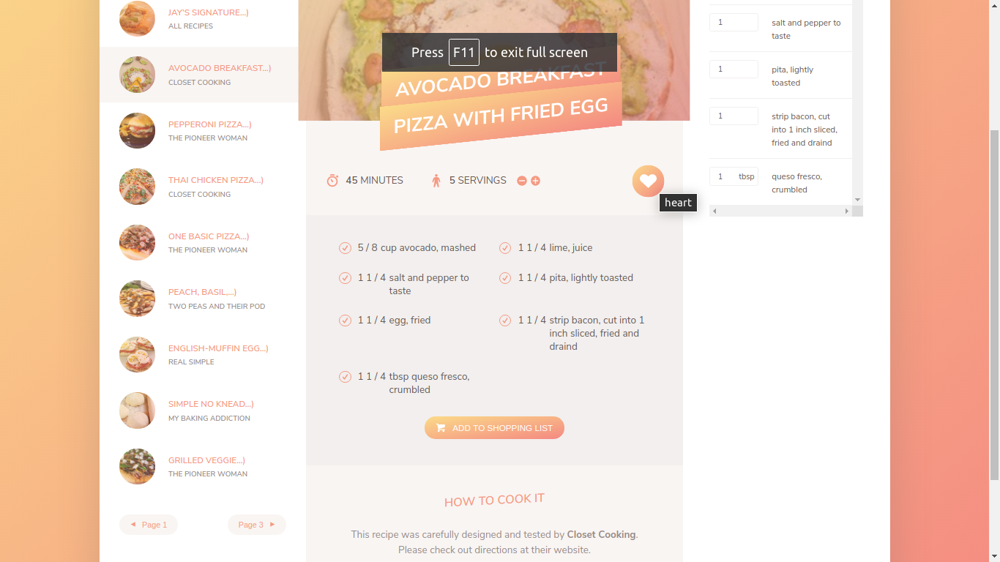
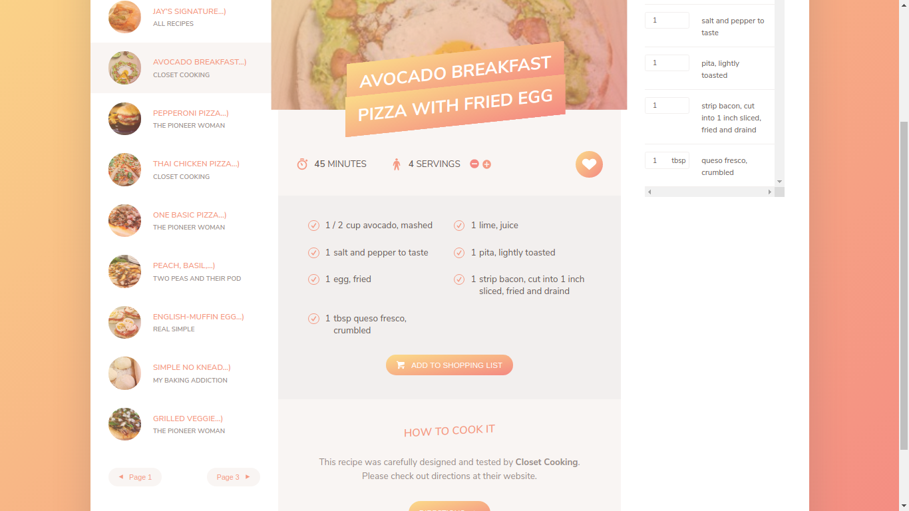

# :fork_and_knife: Forkify-A-food-management-web-app

* Build this project within a week.
* Forkify laverage features like food searching from wide varieties and access to give exact raw materials required to cook a food.

# How to Use

   ### Installation

   * Forkify requires [Node.js](https://nodejs.org/) to run its dependencies.

   * Install the dependencies and devDependencies and start the server.

    ```sh
    $ npm install
    ```

  ### Scripts

   * Forkify utilizes Webpack to compile its files

  #### Run webpack in development mode:

    ```sh
    $ npm run dev
    ```

  #### Run webpack in production mode:

    ```sh
    $ npm run build
    ```

  #### Run webpack-dev-server:

    ```sh
    $ npm run start
    ```
# Functionalities

* User able to serach the food in the search bar.
* In the list of food number of food details shown in the columns.
* User able to see all the details of the ingredients and according to that user able to add the into thier shooping list.
* User also set the food servings details according to the persons.
* They can also add the list into their favorite list of recipe.
* User able to add/remove the list of the ingredients according o their taste.

# Screenshots

  
  
  
  


